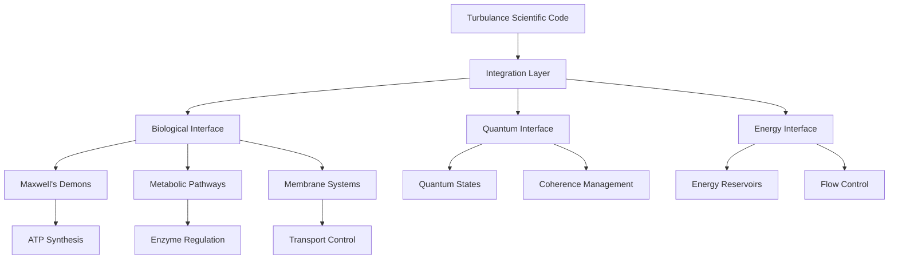

# Biological Integration

This document provides comprehensive guidance for integrating Turbulance with biological computing systems, focusing on the control and optimization of Biological Maxwell's Demons (BMDs) and metabolic processes.

---

## Table of Contents

1. [Integration Architecture](#integration-architecture)
2. [Biological Maxwell's Demons](#biological-maxwells-demons)
3. [Metabolic Pathway Control](#metabolic-pathway-control)
4. [Membrane Interface Management](#membrane-interface-management)
5. [Quantum Biology Integration](#quantum-biology-integration)
6. [Energy Management Systems](#energy-management-systems)
7. [Performance Optimization](#performance-optimization)
8. [Monitoring and Diagnostics](#monitoring-and-diagnostics)

---

## Integration Architecture

### System Overview

The Turbulance biological integration operates through a multi-layered architecture that bridges high-level scientific reasoning with low-level biological processes:



### Integration Components

#### AutobahnTurbulanceIntegration

The main integration class provides comprehensive biological system control:

```rust
pub struct AutobahnTurbulanceIntegration {
    pub turbulance_processor: TurbulanceProcessor,
    pub biological_interface: BiologicalInterface,
    pub quantum_interface: QuantumInterface,
    pub energy_interface: EnergyInterface,
}
```

#### Biological Interface

Manages direct interaction with biological components:

```rust
pub struct BiologicalInterface {
    pub active_demons: HashMap<String, BiologicalMaxwellDemon>,
    pub membrane_states: HashMap<String, MembraneState>,
    pub energy_flows: HashMap<String, EnergyFlow>,
}
```

---

## Biological Maxwell's Demons

### Theoretical Foundation

Biological Maxwell's Demons represent the core innovation of the autobahn system. These entities extract work from thermal fluctuations while maintaining thermodynamic consistency through information processing.

#### Thermodynamic Principles

1. **Energy Conservation**: Total energy remains conserved across all operations
2. **Entropy Balance**: Local entropy reduction compensated by information processing
3. **Information-Energy Coupling**: Work extraction limited by information content

#### Mathematical Framework

The fundamental relationship governing BMD operation:

```
W_extracted ≤ k_B T ln(2) × I_processed
```

Where:
- `W_extracted`: Work extracted from thermal fluctuations
- `k_B`: Boltzmann constant (1.38 × 10⁻²³ J/K)
- `T`: Operating temperature (typically 310 K for biological systems)
- `I_processed`: Information content processed (bits)

### BMD Implementation

#### Basic BMD Structure

```turbulance
# Define a biological Maxwell's demon
funxn create_metabolic_demon(demon_id, energy_threshold):
    item demon = BiologicalMaxwellDemon {
        id: demon_id,
        energy_threshold: energy_threshold,
        state: "inactive",
        processing_history: [],
        information_capacity: 1000.0,  # bits
        current_information: 0.0
    }
    
    return demon
```

#### BMD State Management

Biological Maxwell's Demons operate through distinct states:

1. **Inactive**: Demon is not processing molecules
2. **Monitoring**: Scanning for molecules above energy threshold
3. **Processing**: Actively extracting energy from selected molecules
4. **Harvesting**: Converting extracted energy to useful work
5. **Adapting**: Adjusting parameters based on performance

```turbulance
funxn manage_demon_states(demon):
    given demon.state == "monitoring":
        item molecule_detected = scan_for_molecules(demon.energy_threshold)
        
        given molecule_detected:
            demon.state = "processing"
            demon.current_target = molecule_detected
    
    given demon.state == "processing":
        item energy_extracted = process_target_molecule(demon.current_target)
        item information_gained = calculate_information_content(demon.current_target)
        
        # Verify thermodynamic consistency
        item max_work = boltzmann_constant * temperature * log(2) * information_gained
        
        given energy_extracted <= max_work:
            demon.state = "harvesting"
            demon.current_information += information_gained
        otherwise:
            # Thermodynamic violation - adjust parameters
            demon.energy_threshold *= 1.1
            demon.state = "adapting"
    
    given demon.state == "harvesting":
        item useful_work = convert_to_atp(energy_extracted)
        demon.processing_history.append({
            "energy": energy_extracted,
            "work": useful_work,
            "efficiency": useful_work / energy_extracted,
            "timestamp": current_time()
        })
        demon.state = "monitoring"
```

#### BMD Optimization

Advanced optimization strategies for Maxwell's demons:

```turbulance
proposition BMDOptimization:
    motion MaximizeEfficiency("Demon achieves maximum thermodynamic efficiency")
    motion AdaptiveThreshold("Energy threshold adapts to conditions")
    motion InformationManagement("Information processing optimized")

funxn optimize_demon_performance(demon):
    # Analyze historical performance
    item recent_history = demon.processing_history[-100:]  # Last 100 operations
    item avg_efficiency = mean([h.efficiency for h in recent_history])
    item efficiency_variance = variance([h.efficiency for h in recent_history])
    
    # Evidence-based optimization
    evidence PerformanceData from "demon_monitor":
        collect avg_efficiency
        collect efficiency_variance
        collect demon.current_information
        validate thermodynamic_consistency
    
    # Adaptive threshold adjustment
    given avg_efficiency < 0.8:
        # Lower threshold to catch more molecules
        demon.energy_threshold *= 0.95
        support AdaptiveThreshold with_weight(0.8)
    
    given avg_efficiency > 0.95 and efficiency_variance < 0.05:
        # Increase threshold for selectivity
        demon.energy_threshold *= 1.02
        support MaximizeEfficiency with_weight(0.95)
    
    # Information capacity management
    given demon.current_information > demon.information_capacity * 0.9:
        # Perform information erasure (Landauer's principle)
        item erasure_cost = demon.current_information * boltzmann_constant * temperature * log(2)
        demon.current_information = 0.0
        
        # Account for erasure cost in energy budget
        demon.energy_budget -= erasure_cost
        support InformationManagement with_weight(0.9)
    
    # Metacognitive monitoring
    metacognitive DemonOptimizer:
        track_reasoning("demon_optimization")
        item confidence = evaluate_confidence()
        
        given confidence < 0.7:
            adapt_behavior("extended_monitoring_period")
    
    item optimization_score = evaluate BMDOptimization
    return optimization_score
```

---

## Metabolic Pathway Control

### Pathway Architecture

Metabolic pathways represent complex networks of biochemical reactions. Turbulance provides direct control over these pathways through systematic optimization and regulation.

#### Key Metabolic Pathways

1. **Glycolysis**: Glucose breakdown for energy
2. **Krebs Cycle**: Central metabolic hub
3. **Electron Transport Chain**: ATP synthesis
4. **Pentose Phosphate Pathway**: NADPH production
5. **Fatty Acid Oxidation**: Lipid metabolism

### Glycolysis Control System

```turbulance
# Comprehensive glycolysis pathway control
funxn control_glycolysis_pathway():
    proposition GlycolysisControl:
        motion FluxOptimization("Optimize glucose flux through pathway")
        motion RegulationBalance("Maintain appropriate allosteric control")
        motion EnergyYield("Maximize ATP production efficiency")
    
    # Define glycolysis enzyme network
    item enzymes = {
        "hexokinase": {
            "km": 0.1,  # mM
            "vmax": 100.0,  # μmol/min/mg protein
            "regulation": ["glucose", "glucose_6_phosphate"],
            "inhibitors": ["glucose_6_phosphate"],
            "activators": []
        },
        "phosphofructokinase": {
            "km": 0.3,
            "vmax": 80.0,
            "regulation": ["atp", "amp", "citrate"],
            "inhibitors": ["atp", "citrate"],
            "activators": ["amp", "adp"]
        },
        "pyruvate_kinase": {
            "km": 0.5,
            "vmax": 150.0,
            "regulation": ["atp", "acetyl_coa"],
            "inhibitors": ["atp", "acetyl_coa"],
            "activators": ["fructose_1_6_bisphosphate"]
        }
    }
    
    # Real-time flux control
    funxn control_enzyme_activity(enzyme_name, enzyme_data):
        # Measure current concentrations
        item substrate_conc = extract_information("substrate_" + enzyme_name)
        item product_conc = extract_information("product_" + enzyme_name)
        
        # Calculate base reaction rate
        item base_rate = (enzyme_data.vmax * substrate_conc) / (enzyme_data.km + substrate_conc)
        
        # Apply regulatory effects
        item regulation_factor = 1.0
        
        for regulator in enzyme_data.regulation:
            item regulator_conc = extract_information(regulator + "_concentration")
            
            given regulator in enzyme_data.inhibitors:
                item inhibition = regulator_conc / (regulator_conc + enzyme_data.km)
                regulation_factor *= (1.0 - inhibition)
            
            given regulator in enzyme_data.activators:
                item activation = regulator_conc / (regulator_conc + enzyme_data.km)
                regulation_factor *= (1.0 + activation)
        
        item actual_rate = base_rate * regulation_factor
        
        # Optimize enzyme expression if needed
        given actual_rate < base_rate * 0.5:
            # Upregulate enzyme expression
            update_enzyme_expression(enzyme_name, 1.5)
        
        given actual_rate > base_rate * 1.2:
            # Downregulate to prevent overflow
            update_enzyme_expression(enzyme_name, 0.8)
        
        return actual_rate
    
    # Pathway flux analysis
    item total_flux = 0.0
    item rate_limiting_step = ""
    item min_rate = 1000.0
    
    for enzyme_name, enzyme_data in enzymes.items():
        item enzyme_rate = control_enzyme_activity(enzyme_name, enzyme_data)
        total_flux += enzyme_rate
        
        given enzyme_rate < min_rate:
            min_rate = enzyme_rate
            rate_limiting_step = enzyme_name
    
    # Evidence collection
    evidence PathwayData from "metabolic_flux_analyzer":
        collect total_flux
        collect min_rate
        collect rate_limiting_step
        validate flux_conservation
    
    # Support evaluation
    item average_flux = total_flux / len(enzymes)
    
    given average_flux > 80.0:  # μmol/min/mg
        support FluxOptimization with_weight(0.9)
    
    given min_rate > average_flux * 0.8:
        support RegulationBalance with_weight(0.85)
    
    # ATP yield calculation
    item atp_yield = calculate_atp_yield(total_flux)
    given atp_yield > 1.8:  # mol ATP/mol glucose
        support EnergyYield with_weight(0.9)
    
    metacognitive PathwayController:
        track_reasoning("glycolysis_control")
        
        given rate_limiting_step != "":
            adapt_behavior("optimize_" + rate_limiting_step)
    
    item control_score = evaluate GlycolysisControl
    
    return {
        "control_score": control_score,
        "total_flux": total_flux,
        "rate_limiting_step": rate_limiting_step,
        "atp_yield": atp_yield
    }
```

### Metabolic Network Integration

```turbulance
# Integrate multiple metabolic pathways
funxn integrate_metabolic_network():
    proposition MetabolicIntegration:
        motion PathwayCoordination("Pathways coordinate effectively")
        motion ResourceAllocation("Resources allocated optimally")
        motion HomeostasisMaintenance("System maintains metabolic homeostasis")
    
    # Define pathway network
    item pathways = {
        "glycolysis": {
            "inputs": ["glucose", "atp", "nad+"],
            "outputs": ["pyruvate", "atp", "nadh"],
            "regulation_signals": ["atp", "amp"],
            "priority": 1  # High priority for energy
        },
        "krebs_cycle": {
            "inputs": ["acetyl_coa", "nad+", "fad"],
            "outputs": ["co2", "nadh", "fadh2", "gtp"],
            "regulation_signals": ["nadh", "atp"],
            "priority": 2
        },
        "pentose_phosphate": {
            "inputs": ["glucose_6_phosphate", "nadp+"],
            "outputs": ["ribose_5_phosphate", "nadph"],
            "regulation_signals": ["nadph", "g6p"],
            "priority": 3  # Lower priority
        }
    }
    
    # Network coordination function
    funxn coordinate_pathways():
        item energy_charge = calculate_energy_charge()  # (ATP + 0.5*ADP) / (ATP + ADP + AMP)
        item nadh_nad_ratio = extract_information("nadh_nad_ratio")
        item nadph_nadp_ratio = extract_information("nadph_nadp_ratio")
        
        # Priority-based resource allocation
        given energy_charge < 0.7:
            # Energy stress - prioritize ATP production
            allocate_resources("glycolysis", 0.6)
            allocate_resources("krebs_cycle", 0.3)
            allocate_resources("pentose_phosphate", 0.1)
        
        given energy_charge > 0.9:
            # Energy surplus - shift to biosynthesis
            allocate_resources("glycolysis", 0.3)
            allocate_resources("krebs_cycle", 0.4)
            allocate_resources("pentose_phosphate", 0.3)
        
        # Redox balance management
        given nadh_nad_ratio > 10.0:
            # Excess NADH - activate electron transport
            activate_pathway("electron_transport_chain")
        
        given nadph_nadp_ratio < 0.1:
            # NADPH deficiency - boost pentose phosphate pathway
            allocate_resources("pentose_phosphate", 0.4)
    
    # Execute coordination
    coordinate_pathways()
    
    # Monitor pathway interactions
    item pathway_cross_talk = analyze_pathway_interactions()
    
    given pathway_cross_talk.coordination_index > 0.8:
        support PathwayCoordination with_weight(0.9)
    
    given pathway_cross_talk.resource_efficiency > 0.85:
        support ResourceAllocation with_weight(0.85)
    
    item homeostasis_score = calculate_homeostasis_score()
    given homeostasis_score > 0.9:
        support HomeostasisMaintenance with_weight(0.95)
    
    item integration_score = evaluate MetabolicIntegration
    
    return {
        "integration_score": integration_score,
        "pathway_coordination": pathway_cross_talk.coordination_index,
        "homeostasis": homeostasis_score
    }
```

---

## Membrane Interface Management

### Membrane Structure and Function

Biological membranes serve as critical interfaces for energy transduction and information processing. Turbulance provides sophisticated control over membrane properties and transport processes.

#### Membrane Properties

```turbulance
# Define and control membrane properties
funxn manage_membrane_interface():
    proposition MembraneOptimization:
        motion PermeabilityControl("Optimal permeability for different molecules")
        motion GradientMaintenance("Maintain necessary concentration gradients")
        motion TransportEfficiency("Maximize transport process efficiency")
    
    # Membrane configuration
    item membrane_config = {
        "lipid_composition": {
            "phosphatidylcholine": 0.4,
            "phosphatidylethanolamine": 0.3,
            "phosphatidylserine": 0.2,
            "cholesterol": 0.1
        },
        "permeability_coefficients": {
            "h2o": 1.0e-3,  # cm/s
            "glucose": 1.0e-8,
            "na+": 1.0e-12,
            "k+": 1.0e-11,
            "atp": 1.0e-15
        },
        "transport_proteins": {
            "glucose_transporter": 100,  # molecules per μm²
            "na_k_atpase": 50,
            "proton_pump": 200
        }
    }
    
    # Dynamic permeability control
    funxn control_membrane_permeability(molecule_type, target_flux):
        item current_permeability = membrane_config.permeability_coefficients[molecule_type]
        item current_flux = calculate_flux(molecule_type, current_permeability)
        
        given current_flux < target_flux * 0.9:
            # Increase permeability
            item enhancement_factor = target_flux / current_flux
            membrane_config.permeability_coefficients[molecule_type] *= enhancement_factor
            
            # Implement through membrane modification
            update_membrane_state("increase_" + molecule_type + "_permeability")
        
        given current_flux > target_flux * 1.1:
            # Decrease permeability
            item reduction_factor = target_flux / current_flux
            membrane_config.permeability_coefficients[molecule_type] *= reduction_factor
            
            update_membrane_state("decrease_" + molecule_type + "_permeability")
        
        return membrane_config.permeability_coefficients[molecule_type]
    
    # Gradient management
    funxn maintain_concentration_gradients():
        item gradients = {
            "na+": extract_information("na_gradient"),
            "k+": extract_information("k_gradient"),
            "h+": extract_information("proton_gradient"),
            "ca2+": extract_information("ca_gradient")
        }
        
        for ion, gradient in gradients.items():
            item target_gradient = get_target_gradient(ion)
            
            given gradient < target_gradient * 0.8:
                # Activate ion pumps
                activate_ion_pump(ion)
                increase_pump_activity(ion, 1.5)
            
            given gradient > target_gradient * 1.2:
                # Reduce pump activity
                decrease_pump_activity(ion, 0.8)
        
        return gradients
    
    # Transport optimization
    funxn optimize_transport_processes():
        item transport_efficiency = {}
        
        for protein, density in membrane_config.transport_proteins.items():
            item current_efficiency = measure_transport_efficiency(protein)
            transport_efficiency[protein] = current_efficiency
            
            given current_efficiency < 0.8:
                # Increase protein density
                membrane_config.transport_proteins[protein] *= 1.2
                upregulate_protein_expression(protein)
            
            given current_efficiency > 0.95:
                # Optimize density for energy efficiency
                membrane_config.transport_proteins[protein] *= 0.95
        
        return transport_efficiency
    
    # Execute membrane management
    item key_molecules = ["glucose", "na+", "k+", "atp"]
    for molecule in key_molecules:
        item target_flux = calculate_target_flux(molecule)
        control_membrane_permeability(molecule, target_flux)
    
    item gradients = maintain_concentration_gradients()
    item transport_efficiency = optimize_transport_processes()
    
    # Evidence evaluation
    evidence MembraneData from "membrane_monitor":
        for molecule in key_molecules:
            collect membrane_config.permeability_coefficients[molecule]
        for ion, gradient in gradients.items():
            collect gradient
        for protein, efficiency in transport_efficiency.items():
            collect efficiency
    
    # Support evaluation
    item avg_permeability_optimization = mean([
        abs(calculate_flux(mol, membrane_config.permeability_coefficients[mol]) - calculate_target_flux(mol)) 
        for mol in key_molecules
    ])
    
    given avg_permeability_optimization < 0.1:
        support PermeabilityControl with_weight(0.9)
    
    item gradient_stability = mean([g / get_target_gradient(ion) for ion, g in gradients.items()])
    given gradient_stability > 0.9 and gradient_stability < 1.1:
        support GradientMaintenance with_weight(0.95)
    
    item avg_transport_efficiency = mean(transport_efficiency.values())
    given avg_transport_efficiency > 0.85:
        support TransportEfficiency with_weight(avg_transport_efficiency)
    
    item membrane_score = evaluate MembraneOptimization
    
    return {
        "membrane_score": membrane_score,
        "permeability_config": membrane_config.permeability_coefficients,
        "gradients": gradients,
        "transport_efficiency": avg_transport_efficiency
    }
```

---

## Performance Optimization

### System Performance Metrics

```turbulance
# Comprehensive performance optimization system
funxn optimize_biological_performance():
    proposition SystemPerformance:
        motion EnergyEfficiency("System operates at maximum energy efficiency")
        motion ProcessingSpeed("Biological processes operate at optimal speed")
        motion ResourceUtilization("Resources utilized with minimal waste")
        motion SystemStability("System maintains stable operation")
    
    # Performance monitoring framework
    funxn monitor_system_performance():
        item metrics = {
            "energy_efficiency": calculate_overall_energy_efficiency(),
            "processing_speed": measure_processing_throughput(),
            "resource_utilization": assess_resource_efficiency(),
            "stability_index": calculate_stability_metric(),
            "demon_performance": evaluate_demon_network(),
            "pathway_efficiency": assess_metabolic_efficiency()
        }
        
        return metrics
    
    # Optimization strategies
    funxn apply_optimization_strategies(current_metrics):
        # Energy efficiency optimization
        given current_metrics.energy_efficiency < 0.8:
            optimize_energy_harvesting()
            tune_demon_parameters()
            support EnergyEfficiency with_weight(0.7)
        
        # Processing speed optimization
        given current_metrics.processing_speed < 0.85:
            increase_enzyme_concentrations()
            optimize_pathway_fluxes()
            support ProcessingSpeed with_weight(0.8)
        
        # Resource utilization optimization
        given current_metrics.resource_utilization < 0.9:
            rebalance_metabolic_pathways()
            optimize_substrate_allocation()
            support ResourceUtilization with_weight(0.85)
        
        # Stability optimization
        given current_metrics.stability_index < 0.9:
            implement_feedback_control()
            strengthen_homeostatic_mechanisms()
            support SystemStability with_weight(0.9)
    
    # Iterative optimization loop
    for optimization_cycle in range(100):
        item current_metrics = monitor_system_performance()
        apply_optimization_strategies(current_metrics)
        
        # Metacognitive performance assessment
        metacognitive PerformanceOptimizer:
            track_reasoning("system_optimization")
            item confidence = evaluate_confidence()
            
            given confidence > 0.9:
                # High confidence - fine-tune parameters
                apply_fine_tuning()
            
            given confidence < 0.7:
                # Low confidence - apply more aggressive optimization
                apply_aggressive_optimization()
        
        # Check convergence
        given all([
            current_metrics.energy_efficiency > 0.9,
            current_metrics.processing_speed > 0.9,
            current_metrics.resource_utilization > 0.9,
            current_metrics.stability_index > 0.95
        ]):
            print("Optimization converged at cycle " + str(optimization_cycle))
            break
    
    item final_performance = evaluate SystemPerformance
    
    return {
        "performance_score": final_performance,
        "optimization_cycles": optimization_cycle,
        "final_metrics": current_metrics
    }
```

This comprehensive biological integration documentation provides the foundation for effectively utilizing Turbulance in biological computing applications, with particular emphasis on Maxwell's demons, metabolic control, and system optimization.

---

**© 2024 Autobahn Biological Computing Project. All rights reserved.** 