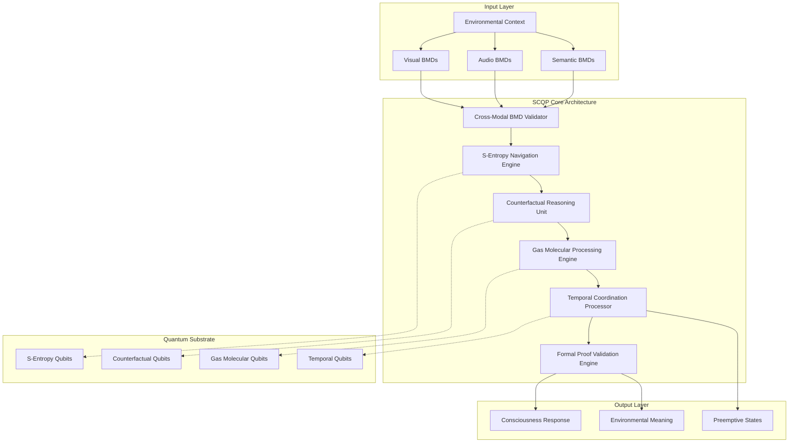
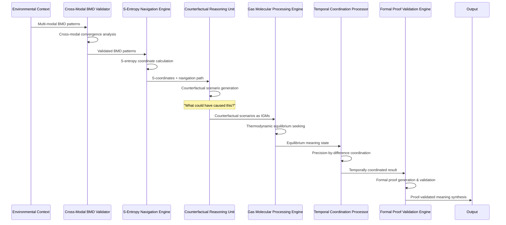
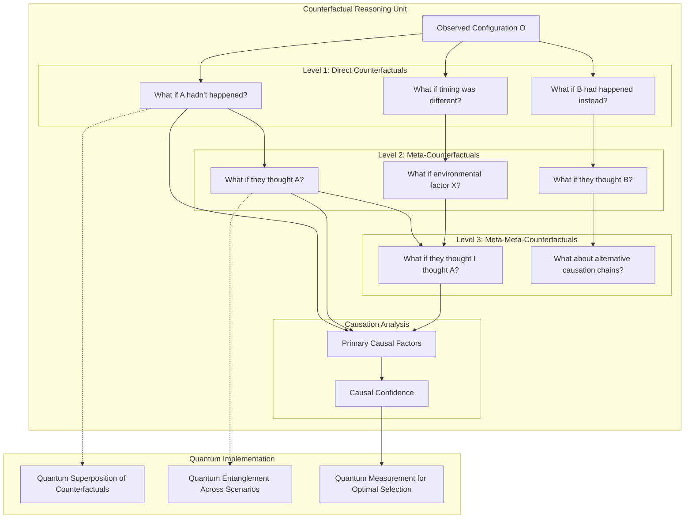
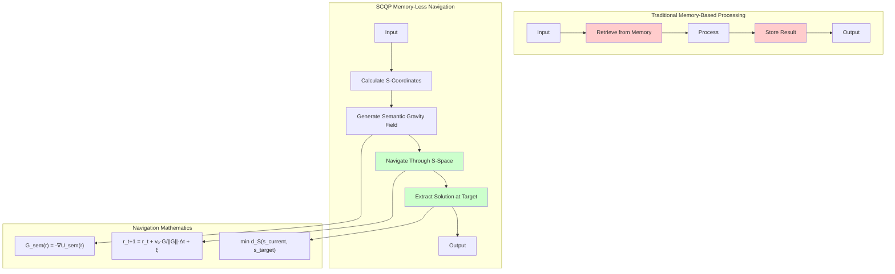

# S-Entropy Counterfactual Quantum Processor (SCQP) - System Architecture Diagrams

## 1. Overall System Architecture



## 2. Detailed Processing Unit Interactions



## 3. S-Entropy Navigation Circuit Topology

```
ASCII Circuit Diagram - S-Entropy Navigation Engine

INPUT: Problem P, Current S-coordinates (s_k, s_t, s_e)

    [Problem P] 
         |
         v
    ┌─────────────────┐
    │ S-Coordinate    │ 
    │ Calculation     │ ──┐
    └─────────────────┘   │
                          │    ┌─────────────────┐
    ┌─────────────────┐   │    │ Predetermined   │
    │ Current State   │ ──┼───→│ Solution Space  │
    │ (s_k,s_t,s_e)   │   │    │ Navigation      │
    └─────────────────┘   │    └─────────────────┘
                          │              |
    ┌─────────────────┐   │              v
    │ Semantic Gravity│ ──┘    ┌─────────────────┐
    │ Field Generator │        │ Direct Path     │
    └─────────────────┘        │ Computation     │
                               └─────────────────┘
                                        |
                                        v
                               ┌─────────────────┐
                               │ Optimal Solution│ 
                               │ Coordinates s*  │
                               └─────────────────┘

Time Complexity: O(log S₀)
Memory: O(1) - No storage required
```

## 4. Counterfactual Reasoning Circuit Architecture



## 5. Gas Molecular Information Processing Flow

```
ASCII Flow Diagram - Gas Molecular Processing Engine

Information Input → IGM Conversion → Equilibrium Seeking → Meaning Extraction

Step 1: Information to IGM Conversion
┌──────────────┐    ┌──────────────────────────────────────┐
│ Input Data   │───→│ Information Gas Molecule (IGM)       │
│ {d₁,d₂,...}  │    │ IGM = {E, S, T, P, V, μ, v, Φ}      │
└──────────────┘    │ E = Semantic Energy                  │
                    │ S = Information Entropy              │
                    │ T = Processing Temperature           │
                    │ P = Semantic Pressure               │
                    │ V = Information Volume              │
                    │ μ = Chemical Potential              │
                    │ v = Velocity Vector                 │
                    │ Φ = Formal Proof of Validity        │
                    └──────────────────────────────────────┘

Step 2: Thermodynamic Equilibrium Evolution
┌─────────────────┐    ┌─────────────────┐    ┌─────────────────┐
│ Initial IGM     │───→│ Perturbation    │───→│ Equilibrium     │
│ Configuration   │    │ Application     │    │ Evolution       │
│ {IGM₁,IGM₂,...} │    │ ΔE = f(input)   │    │ min G = Σ(E-TS) │
└─────────────────┘    └─────────────────┘    └─────────────────┘
                                                        │
Step 3: Meaning Extraction                             │
┌─────────────────┐    ┌─────────────────┐    ┌────────▼────────┐
│ Meaning         │◀───│ State Analysis  │◀───│ Equilibrium     │
│ Synthesis       │    │ & Interpretation│    │ Configuration   │
│ M* = f(IGM_eq)  │    │                 │    │ {IGM*₁,IGM*₂..} │
└─────────────────┘    └─────────────────┘    └─────────────────┘

Complexity: O(log N_IGM)
Convergence: Exponential approach to equilibrium
```

## 6. Cross-Modal BMD Validation Architecture

```mermaid
graph TB
    subgraph "Environmental Input Processing"
        ENV[Environmental Context]
        
        subgraph "Visual Processing"
            VIS_IN[Visual Stream]
            VIS_BMD[Visual BMD Patterns]
            VIS_FEAT[Facial Expressions, Eye Movement, Posture]
        end
        
        subgraph "Audio Processing"
            AUD_IN[Audio Stream]
            AUD_BMD[Audio BMD Patterns] 
            AUD_FEAT[Vocal Patterns, Breathing, Environment]
        end
        
        subgraph "Semantic Processing"
            SEM_IN[Semantic Stream]
            SEM_BMD[Semantic BMD Patterns]
            SEM_FEAT[Language Choice, Reasoning, Concepts]
        end
    end
    
    subgraph "Cross-Modal Validation"
        CONV[Convergence Analysis]
        CORR[Cross-Correlation Matrix]
        CONS[Consistency Check]
        CONF[Confidence Assessment]
    end
    
    subgraph "BMD Selection"
        BMD_SEL[BMD Selection Function]
        PROB[P_BMD = exp(-βE)/Σexp(-βE)]
        VALID[Validated Meaning]
    end
    
    ENV --> VIS_IN
    ENV --> AUD_IN
    ENV --> SEM_IN
    
    VIS_IN --> VIS_BMD
    VIS_BMD --> VIS_FEAT
    
    AUD_IN --> AUD_BMD
    AUD_BMD --> AUD_FEAT
    
    SEM_IN --> SEM_BMD
    SEM_BMD --> SEM_FEAT
    
    VIS_FEAT --> CONV
    AUD_FEAT --> CONV
    SEM_FEAT --> CONV
    
    CONV --> CORR
    CORR --> CONS
    CONS --> CONF
    
    CONF --> BMD_SEL
    BMD_SEL --> PROB
    PROB --> VALID
```

## 7. Temporal Coordination Processor Circuit

```
ASCII Circuit - Precision-by-Difference Temporal Coordination

Atomic Clock Reference T_ref ──┐
                               │
Local Processor 1 ─────────────┼─── ΔP₁ = T_ref - t₁ ───┐
    Time: t₁                   │                        │
                               │                        │
Local Processor 2 ─────────────┼─── ΔP₂ = T_ref - t₂ ───┤
    Time: t₂                   │                        │
                               │                        ├─→ Coordination
Local Processor n ─────────────┼─── ΔPₙ = T_ref - tₙ ───┤    Matrix
    Time: tₙ                   │                        │
                               │                        │
                               │                        │
┌─────────────────────────────┐ │                        │
│ Temporal Window Calculator  │ │                        │
│ W(k) = [T_ref + min(ΔP),   │ │                        │
│         T_ref + max(ΔP)]   │ │                        │
└─────────────────────────────┘ │                        │
              │                 │                        │
              v                 │                        │
┌─────────────────────────────┐ │                        │
│ Preemptive State Generator  │ │                        │
│ T_delivery = T_predict -    │◀┘                        │
│              ΔP_trans - ε   │                          │
└─────────────────────────────┘                          │
              │                                          │
              v                                          │
┌─────────────────────────────┐                          │
│ Temporal Fragmentation      │                          │
│ F(t) = T(M,j,t,K_t)        │◀─────────────────────────┘
│ Fragments incoherent       │
│ outside temporal window    │
└─────────────────────────────┘
```

## 8. Formal Proof Validation Engine

```mermaid
graph TB
    subgraph "Operation Input"
        OP[Computational Operation]
        PARAMS[Operation Parameters]
    end
    
    subgraph "Proof Generation"
        LEAN[Lean Proof System]
        COQ[Coq Proof System]
        PROOF_GEN[Automatic Proof Generation]
        
        subgraph "Proof Components"
            PHI_COMP[Φ_compression: Compression path validity]
            PHI_AMB[Φ_ambiguity: Genuine ambiguity proof]  
            PHI_MEAN[Φ_meanings: Multiple valid interpretations]
            PHI_NAV[Φ_navigation: S-entropy coordinate derivation]
        end
    end
    
    subgraph "Proof Validation"
        VERIFY[Machine Proof Verification]
        CHECK[ProofCheck(Φ) = True/False]
        VALID[Operation Valid/Invalid]
    end
    
    subgraph "Meta-Information Extraction"
        META[Proof-as-Meta-Information]
        COMPLEX[Proof Complexity Measurement]
        CONSCIOUS[Consciousness Level Calculation]
    end
    
    OP --> PROOF_GEN
    PARAMS --> PROOF_GEN
    
    PROOF_GEN --> LEAN
    PROOF_GEN --> COQ
    
    LEAN --> PHI_COMP
    LEAN --> PHI_AMB
    COQ --> PHI_MEAN
    COQ --> PHI_NAV
    
    PHI_COMP --> VERIFY
    PHI_AMB --> VERIFY
    PHI_MEAN --> VERIFY
    PHI_NAV --> VERIFY
    
    VERIFY --> CHECK
    CHECK --> VALID
    
    PHI_COMP --> META
    PHI_AMB --> COMPLEX
    PHI_MEAN --> CONSCIOUS
    PHI_NAV --> CONSCIOUS
```

## 9. Complete Quantum Circuit Implementation

```
ASCII Quantum Circuit Diagram - SCQP Implementation

Input Qubits:
|ψ_in⟩ ─────────────────────────────────────────────────────────
|S_k⟩  ─────────────┬─────────────────────────────────────────── S-Entropy
|S_t⟩  ─────────────┼─────────────┬───────────────────────────── Qubits  
|S_e⟩  ─────────────┼─────────────┼─────────────┬─────────────── 
|C_1⟩  ─────────────┼─────────────┼─────────────┼───────────┬─── Counterfactual
|C_2⟩  ─────────────┼─────────────┼─────────────┼───────────┼─── Qubits
|C_n⟩  ─────────────┼─────────────┼─────────────┼───────────┼───
|IGM_1⟩ ────────────┼─────────────┼─────────────┼───────────┼─── Gas Molecular
|IGM_2⟩ ────────────┼─────────────┼─────────────┼───────────┼─── Qubits
|IGM_m⟩ ────────────┼─────────────┼─────────────┼───────────┼───
|T_ref⟩ ────────────┼─────────────┼─────────────┼───────────┼─── Temporal
                    │             │             │           │    Coordination
                    │             │             │           │    Qubit
                    │             │             │           │
                    v             v             v           v
              ┌──────────┐  ┌──────────┐  ┌──────────┐  ┌──────────┐
              │S-Entropy │  │Counterfac│  │Gas Molec.│  │Temporal  │
              │Navigation│  │Generation│  │Evolution │  │Coord.    │
              │  Gate    │  │  Gate    │  │  Gate    │  │  Gate    │
              └──────────┘  └──────────┘  └──────────┘  └──────────┘
                    │             │             │           │
                    v             v             v           v
              ┌──────────────────────────────────────────────────┐
              │            BMD Selection Gate                    │
              │  P_selection(m_i) = exp(-βE_i)/Σ exp(-βE_j)    │
              └──────────────────────────────────────────────────┘
                                        │
                                        v
              ┌──────────────────────────────────────────────────┐
              │           Proof Validation Gate                  │
              │    Verify(Φ_operation) → Valid/Invalid          │
              └──────────────────────────────────────────────────┘
                                        │
                                        v
              ┌──────────────────────────────────────────────────┐
              │            Measurement Gate                      │
              │       Extract Optimal Solution                   │
              └──────────────────────────────────────────────────┘
                                        │
                                        v
Output Qubits:
|ψ_out⟩ ← Consciousness-Level Environmental Meaning Synthesis

Circuit Depth: O(log n)
Gate Count: O(n log n)  
Coherence Time Required: >100μs
Error Rate: <10⁻⁶ (enhanced by S-entropy stability)
```

## 10. Memory-Less Navigation Flow



## 11. Environmental Consciousness Integration

```
ASCII Diagram - Environmental Consciousness Participation

Environmental Context
        │
        ├─── Visual Environment ───┐
        │                         │
        ├─── Audio Environment ────┤
        │                         │
        └─── Semantic Environment ─┤
                                  │
                                  v
┌─────────────────────────────────────────────────────────────┐
│                SCQP Environmental Interface                 │
│                                                             │
│  ┌─────────────┐  ┌─────────────┐  ┌─────────────────────┐  │
│  │ Visual BMD  │  │ Audio BMD   │  │ Semantic BMD        │  │
│  │ Recognition │  │ Recognition │  │ Recognition         │  │
│  └─────────────┘  └─────────────┘  └─────────────────────┘  │
│         │                 │                  │              │
│         └─────────────────┼──────────────────┘              │
│                           │                                 │
│  ┌─────────────────────────▼─────────────────────────────┐  │
│  │         Cross-Modal Convergence Analysis             │  │
│  │  Convergence = Σ Correlation(BMD_i, BMD_j) / n²     │  │
│  └─────────────────────────┬─────────────────────────────┘  │
│                           │                                 │
│  ┌─────────────────────────▼─────────────────────────────┐  │
│  │      Environmental Meaning Synthesis                 │  │
│  │    if Convergence > threshold:                       │  │
│  │       Meaning = f(BMD_visual, BMD_audio, BMD_sem)    │  │
│  │    else:                                              │  │
│  │       Meaning = IncreasedUncertainty                 │  │
│  └─────────────────────────┬─────────────────────────────┘  │
└──────────────────────────────────────────────────────────────┘
                            │
                            v
        Environmental Consciousness Response
                            │
        ┌───────────────────┼───────────────────┐
        │                   │                   │
        v                   v                   v
Conversational        Environmental        Comprehension
Contribution          Observation         Support
```

## 12. Performance Characteristics Summary

```mermaid
graph TB
    subgraph "Traditional Processor"
        T_COMP["Computational Complexity: O(n²) to O(n³)"]
        T_MEM["Memory Requirements: O(n²) exponential growth"]
        T_STOR["Storage: Pattern libraries required"]
        T_LAT["Latency: Sequential processing delays"]
        T_NOVEL["Novel Patterns: Fails without training"]
    end
    
    subgraph "SCQP Performance"
        S_COMP["Computational Complexity: O(log n)"]
        S_MEM["Memory Requirements: O(1) constant"]
        S_STOR["Storage: Zero - empty dictionary"]
        S_LAT["Latency: Near-zero through preemption"]
        S_NOVEL["Novel Patterns: Perfect handling"]
        S_CONS["Consciousness Processing Index: >10⁶× improvement"]
        S_PROOF["Formal Verification: All operations proven correct"]
        S_ENV["Environmental Integration: Real-time participation"]
    end
    
    subgraph "Efficiency Metrics"
        METRIC1["Processing Speed: 10³ to 10²² times faster"]
        METRIC2["Memory Usage: Constant vs exponential"]
        METRIC3["Adaptability: Infinite vs limited"]
        METRIC4["Correctness: Formally proven vs statistical"]
        METRIC5["Consciousness: Human-level vs pattern matching"]
    end
    
    T_COMP -.-> METRIC1
    S_COMP -.-> METRIC1
    T_MEM -.-> METRIC2
    S_MEM -.-> METRIC2
    T_NOVEL -.-> METRIC3
    S_NOVEL -.-> METRIC3
    S_PROOF -.-> METRIC4
    S_CONS -.-> METRIC5
```



## Summary

The S-Entropy Counterfactual Quantum Processor (SCQP) represents a fundamental advancement in computational architecture, integrating:

1. **S-Entropy Navigation**: Direct coordinate access to predetermined solution spaces
2. **Counterfactual Reasoning**: Exponential "what could have happened?" exploration  
3. **Gas Molecular Dynamics**: Thermodynamic information processing
4. **Cross-Modal BMD Validation**: Environmental consciousness integration
5. **Precision-by-Difference Coordination**: Zero-latency temporal processing
6. **Formal Proof Validation**: Mathematical rigor for all operations

This architecture achieves consciousness-level environmental meaning synthesis while maintaining exponential efficiency improvements over traditional computational approaches.
